## Writting_week1

# 1. Unix Command Line 

### Apa itu CLI ?

CLI atau "Command Line Interface", adalah antarmuka pengguna yang memungkinkan melakukan operasi fungsional apa pun pada sistem dengan menerima input dalam bentuk perintah, alih-alih mengklik dan mengetik bentuk input. Hal ini umum dalam Sistem Operasi Disk tradisional (DOS), di mana perintah dimasukkan dalam antarmuka prompt perintah DOS. Akhir-akhir ini, CLI ini diterapkan oleh perangkat lunak atau administrator sistem untuk mengkonfigurasi sistem komputer, karena tindakan serupa dalam antarmuka pengguna grafis (GUI) dapat memakan banyak waktu dan tindakan manual.

**Pengertian shell**
Shell adalah program yang menerima perintah, kemudian meneruskan perintah tersebut ke system untuk dieksekusi.

**Pengertian Terminal**
Terminal Emulator adalah aplikasi untuk mengakses CLI.

### Contoh Command Line Interface (CLI)
sh, bash, zsh, cmd.exe . 
contoh tampilan CLI, seperti gambar dibawah:


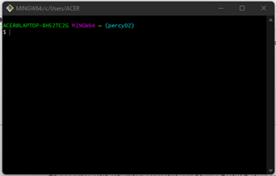

## Navigasi menggunakan CLI

**File system** 


cara sederhana untuk mengatur dan menyimpan file pada hard drive, flash drive atau perangkat penyimpanan lainnya. Setiap perangkat penyimpanan memiliki satu atau lebih partisi, dan masing-masing partisi diformat dengan file system. Proses pemformatan hanya menciptakan file system kosong pada perangkat. berikut merupakan tampilan stuktur file system:

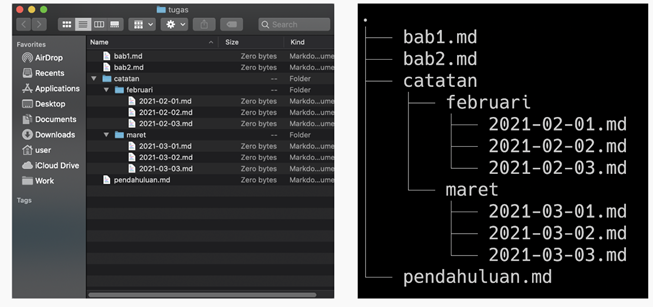

#### root directory
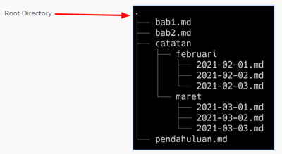

#### Unix like dengan windows
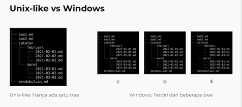

#### Apa saja command untuk Navigasi 
- Print working directory (pwd) = Command untuk melihat current working directory
- lists (ls) = command untuk melihat isi file yang ada di sebuah directori
- change directory (cd) = command untuk berpindah direktori


#### Absolute pathname & Relative Pathname
Absolute pathname dimulai dari root directory. ct : /Users/user/Work/GitHub/skilvul/tugas

sedangkan Relative pathname dimulai dari current working directory. 
ct: 
##### ./catatan

##### ../skilvul/folder-lain

##### `..`


#### Manipulasi files to CLI , menggunakan:
touch = command untuk membuat sebuah file 
mkdir = Command untuk membuat sebuah directory 


#### Melihat isi files , menggunakan :
head = commad untuk melihat beberapa line awal dari sebuah file text
tail = command untuk melihat beberapa line awal dari sebuah file text
cat = command untuk melihat isi sebuah file 


#### Menyalin, memindahkan dan menghapus files dna directory
cp = Command untuk mengcopy files atau directory
mv= Command untuk memindahkan files atau directory. Bisa digunakan untuk rename.
rm = Command untuk menghapus file atau directory


# 2. Git & Github 

#### Pengertian Git & Github

- Git merupakan salah satu sistem pengontrol versi (Version Control System) pada proyek perangkat lunak yang bertugas mencatat       setiap perubahan pada file proyek yang dikerjakan oleh banyak orang maupun sendiri. 

- GitHub merupakan layanan cloud yang berguna untuk menyimpan dan mengelola sebuah project yang dinamakan repository (repo git).

#### Mengapa Git dan Github itu penting?
Sepandai apapun programmer, tidak akan pernah bisa bekerja sendirian selamanya Dengan menggunakan GIT dan Github, 
kita akan bisa bekerja dalam sebuat tim. Tujuan besarnya adalah kamu bisa berkolaborasi mengerjakan proyek yang sama
tanpa harus repot copy paste folder aplikasi yang terupdate. Kita juga tidak perlu menunggu rekan dalam satu tim kamu menyelesaikan suatu program dahulu untuk berkolaborasi. Kita bisa membuat file didalam projek yang sama atau membuat code di file yang sama dan menyat
dan menyatukannya saat sudah selesai

#### Alur Kerja 

1. Untuk langkah pertama dalam menggunakan git dan github, kita perlu mendownload terlebih dahulu GitBash. 
2. jika sudah, installasi seperti pada umumnya, 
3. kemudian melakukan setup awal dengan memasukan email dan username ( Email yang disetup **Harus sama** dengan yang di gunakan di GITHUB)
4. selanjutnya cek apakah setup berhasil atau tidak

## **Repositori Git**

Repository adalah direktori proyek yang kita buat. 1 Repo =  1 Proyek = 1 Direktori. 

  - Perintah dasar git yang lain
    1. git status <br/>
    Perintah git status menampilkan daftar file yang berubah bersama dengan file yang ingin di tambahkan atau di-commit. <br/>

            git status
    2. git add <br/>
    Perintah git add bisa digunakan untuk menambahkan file ke index. Seperti contoh, perintah berikut akan menambahkan file bernama README.md yang ada di direktori lokal ke index: <br/>

            git add README.md
    3. git commit <br/>
    Perintah git commit digunakan untuk melakukan commit pada perubahan ke head. Ingat bahwa perubahan apapun yang di-commit tidak akan langsung ke remote repository.
    
            git commit –m “Isi dengan keterangan untuk commit”
    
    4. git log <br/>
    Dengan menjalankan peritah ini akan menampilkan daftar commits yang ada di branch beserta detail-nya.</br>
            
            git log
            
    5. git checkout <br/>
    Perintah git checkout bisa digunakan untuk membuat branch atau untuk berpindah diantaranya. Misalnya, perintah berikut ini akan membuat branch baru dan berpindah ke dalamnya:
    
            command git checkout -b <nama-branch>
        Untuk berpindah dari branch satu ke lainnya, gunakan:
          
            git checkout <branch-name>
    6. git reset <br/>
    Untuk me-reset index dan bekerja dengan kondisi commit paling baru, gunakan perintah git reset:

            git reset --hard HEAD
    7. git revert <br/>
    Perintah git revert akan mengembalikan kondisi berkas yang ada dimasa lalu, selanjutnya akan digabungkan dengan commit -an terakhir dimasa sekarang.
    
            git revert -n <nomer commit>
    8. git branch <br/>
    Perintah git branch bisa digunakan untuk me-list, membuat atau menghapus branch. Untuk menampilkan semua branch yang ada di repository, gunakan:

            git branch
        Untuk menghapus branch:
        
            git branch -d <branch-name>
    9. git merge<br/>
    Perintah merge digunakan untuk menggabungkan sebuah branch ke branch aktif. 

            git merge <nama-branch>

    10. git clone </br>
    Langkah pertama untuk membuat clone kita harus mengakses link repository yang ingin di clone setelah itu buka git bash/cmd dan masuk ke dalam direktori penyimpanan untuk menyimpan hasil clone. kemudian ketik

            git clone "link repositori yang ingin simpan"


# 3. HTML

## Pengertian HTML
**HTML** adalah bahasa standar pemrogaman yang digunakan untuk membuat halaman website, yang diakses melalui internet. Singkatan dari **Hypertext Markup Language** atau **bahasa markup**.
**HTML** digunakan untuk menampilkan konten pada browser. 
HTML bersifat **statis**. 
HTML hanya bertugas menampilkan konten yang diminta oleh developer.


Ada 2 tools utama yang harus dipersiapkan untuk membuat HTML
- Browser
- Code Editor

## Dasar-dasar HTML

Kita bisa menuliskan HTML tanpa structure dan kita bisa tetap menjalankan nya tetapi untuk menjalankannya dengan baik kita perlu HTML Structure
### HTML Struktur

**HTML** tersusun sebagai kesatuan dari sebuah tingkatan (family tree relationship).

**Child element** adalah saat sebuah element berada di dalam element lain.

**Parent element** adalah element yang berada diatas element lain.

### HTML Anatomy


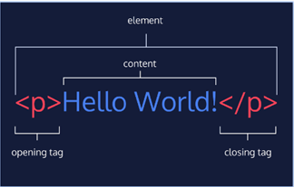

### HTML Element

**HTML element** didefinisikan dengan opening tag, content, dan closing tag.

### HTML Attributes

**Attribute** adalah properties dari sebuah HTML Element.
Semua HTML Element memiliki attribute.

### HTML Comment

Programmer bisa disebut handal jika Kode yang dibuat dapat dengan mudah dimengerti oleh sesama programmer didalam tim misalnya.
Dengan menggunakan **HTML Comment**, kita dapat memberikan penjelasan maksud dari line code yang kita kerjakan.

Comment ini pasti selalu ada dalam bahasa pemrograman apapun.
Comment tidak akan dieksekusi oleh sistem.
Comment hanya untuk dibaca oleh sesama programmer.


## Cara Menjalankan HTML

Kita bisa menjalankan HTML dengan mencari lokasi file HTML kita lalu membukanya via browser. Tetapi dapat juga dengan menggunakan *Live Server* pada Visual Studio Code.

## Cara membaca dokumentasi

Untuk melihat seluruh element yang disediakan oleh HTML, kita bisa cek dokumentasi yang disediakan.

Cek dokumentasi :
Resource by Mozilla
Documentation by W3schools

Tidak semua HTML Element memiliki content.
Seperti element <br>. Element ini disebut empty element.Empty element tidak memiliki closing tag.

Setelah mempelajari berbagai hal diatas selanjutnya kita mencoba membuat web blog sederhana

### Alt

**Alt** adalah alternative. Jika gambar tidak berhasil dimunculkan kita bisa memberi tahu ke user di tag img kita menampilkan gambar apa

### Video

Jika img untuk menampilkan gambar maka sesuai namanya tag video untuk menampilkan video. 
Video merupakan double closing tag sehingga kita menaruh konten di antara opening dan closing

### Controls

Controls berguna untuk kita bisa mengatur videonya di play / pause dan indikator menit

### Table

**Table** adalah salah satu elemen yang akan sering kita temukan dan gunakan.

### HTML Form

Salah satu contoh element form yaitu registrasi dan login.

### Semantic HTML

**Semantic** artinya kita menggunakan element html yang sesuai dengan kebutuhan konten.

kegunaan lain dari semantic HTML, yaitu:
- Meningkatkan Accessibility 
- Meningkatkan SEO 
- Lebih mudah di maintain 

### Deploy HTML

**Deploy** adalah sebuah proses untuk menyebarkan aplikasi yang sudah kita kerjakan supaya bisa digunakan oleh orang-orang.
untuk mendeploy kita bisa menggunakan tools bernama **Netlify**

 # 4. CSS (Cascading Style Sheets)
 
 **CSS** adalah bahasa yang digunakan untuk mendesain halaman website.
Dengan CSS, kita bisa mengubah warna, menggunakan font custom, editing text format, mengatur tata letak, dan lainnya.

Jika pada HTML saja terdapat kerangka seperti head dan body atau disebut **Structural Layer**, sedangkan jika menggabungkan HTML dengan CSS maka dapat menjadi lengkap yang disebut **Presentation Layer**

## Struktur CSS


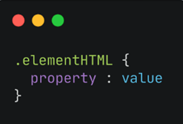

Pada gambar diatas terdapat 3 struktur code CSS diantaranya :
- Selektor
- Blok deklarasi
- Properti dan Nilainya (Value)

## CSS Comment

Dengan menggunakan CSS Comment, kita dapat memberikan penjelasan maksud dari line code yang kita kerjakan.
**Comment** tidak akan dieksekusi oleh sistem.
**Comment** hanya untuk dibaca oleh sesama programmer.

Untuk menggunakan comment dapat menambahkan pada awal kalimat berupa tanda **(/*)** 

## 3 Cara Menggunakan CSS

1. **Inline Styles** adalah kita menambahkan CSS pada attribute element HTML
2. **Internal CSS** digunakan untuk memberi style yang hanya berlaku pada satu laman web. Style yang diberikan diapit oleh tag *style* dan diletakkan di bagian elemen head atau tag *head* dari laman web.
3. **External CSS** adalah file berekstensi .css yang hanya berisi kode-kode style. Tujuan menggunakan external CSS adalah untuk memisahkan kode style dengan struktur dan tipe konten laman web.

## CSS Files

Jika kita membutuhkan banyak code pada CSS, direkomendasikan untuk memisahkan code CSS di file tersendiri (extension .css) dan terpisah dari file HTML.

## Access file .css in HTML

Tidak ada aturan baku untuk penempatan path file .css.
Namun harus dalam 1 folder project yang sama.

## CSS - Tag Name

Kita bisa menggunakan Tag Elemen HTML secara langsung pada CSS.
Jika menggunakan Tag Element, maka ini bersifat **global**.
**Global** artinya akan mempengaruhi seluruh Tag Elemen HTML yang ada pada file tersebut

## CSS - Class Name

Kita bisa menggunakan attribute class pada elemen HTML lalu memanggil nama class tersebut pada CSS
HTML yang memiliki class yang sama, akan mempunyai styling yang sama saat digunakan pada CSS.
Walaupun semisal ketiga heading memiliki element tag yang sama, itu tidak membuat styling/desain yang sama untuk ketiga heading karena menggunakan class. 

Untuk memanggil class pada CSS dapat menggunakan **(.)**.

## CSS - Multiple Class

Kita dapat menggunakan lebih dari 1 class yang berbeda untuk 1 element HTML.

## CSS - ID Name

**ID Name** bersifat unik artinya hanya ada 1 nama ID pada 1 element HTML.
Biasanya digunakan jika hanya ada 1 element pada 1 page. Contohnya navigation header dan footer.

Tidak mungkin kan ada 2 footer dalam 1 page? Nah jadi kita bisa gunakan ID jika element tersebut unik dan hanya ada 1.

Untuk memanggil element ID HTML pada CSS menggunakan **(#namaID)**

**Perbedaan Class Name dan ID Name**

Gunakan ID Name jika hanya ada 1 elemen pada file/halaman HTML.
Contohnya navigation dan footer.
Gunakan Class Name jika akan ada beberapa element HTML yang memiliki styling/desain yang sama.

## Chaining Selectors

Chaining selector dapat kita gunakan pada case/kasus berikut.

Jika kita memiliki 3 tag elemen HTML pada CSS namun kita ingin ada 1 elemen HTML yang memiliki styling berbeda.

## Nested Element

Konsep CSS sama dengan HTML yaitu setiap element memiliki parent dan child.

## important CSS

!important CSS berada di level paling atas dari ID dan Class.

Maksudnya adalah jika pada styling CSS kita menggunakan !important, maka styling sebelumnya baik itu ID Name atau Class Name akan di override.

## Multiple Selector

Pada CSS kita bisa membuat code lebih efisien dan tidak repetitive (melakukan hal yang sama berulang-ulang).

# 5.  Algoritma

Algoritma adalah metode atau langkah yang direncanakan secara tersusun dan berurutan untuk menyelesaikan atau memecahkan permasalahan dengan sebuah intruksi atau kegiatan.

## Ciri-ciri Algoritma

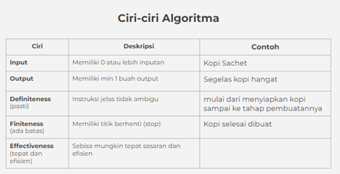

## Jenis proses algoritma
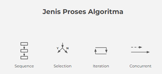

## Berbagai Cara Menulis Algoritma

1. Deskriptif

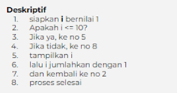

2. Pseudocode 

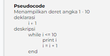

3. Flowchart
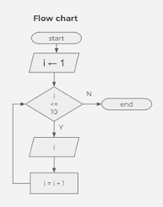

Pada umumnya pseudocode memiliki 3 bagian:
1. Judul : Penjelasan dari algoritma yg dibuat
2. Deklarasi : Mendefinisikan/menyiapkan semua nama (variabel) yg akan digunakan
3. Deskripsi : langkah-langkah penyelesaian masalah

Tidak ada aturan baku dalam penulisan pseudocode, asalkan:
- Jelas
- Simple
- Konsisten
- Dan mudah dibaca org lain


# JavaScript

Javascript adalah bahasa pemograman yang sangat powerful yang digunakan untuk logic pada sebuah website.
Javascript juga dapat membuat website menjadi interaktif dan dinamis.

**Menjalankan JavaScript**

Javascript dijalankan melalui browser pada device setiap user. 
Umumnya browser Chrome dan Mozilla yang sudah support untuk semua fitur Javascript.

**Syntax dan Statement**

Syntax bisa dianalogikan seperti kosa kata (vocabulary) dan tata cara (grammar) pada bahasa pemograman.
Kita menggunakan syntax tertentu untuk membuat statement program, instruksi untuk djalankan/dieksekusi oleh web browser, compiler, ataupun intrepreter

Contoh Syntax JavaScript
- Alert()
- Prompt()
- Confirm()

## Console Log

**Console Log** adalah hal yang krusial bagi developer web.
**Console log** adalah tempat kita untuk cek logic pemograman web yang kita kembangkan.
Console log juga tempat kita untuk melakukan debugging (mengetahui error pada code) pada pemograman web

## Comment

**Comments** adalah sintaks yang digunakan untuk memberi keterangan tentang suatu statement. Menggunakan bahasa inggris atau bahasa indonesia.
**Comments** tidak akan dijalankan oleh program karena hanya untuk dibaca oleh sesama programmer ataupun diri sendiri untuk memahami maksud dan tujuan sebuah statement/syntax.
Terdapat 2 macam comment :
- Single Comment
- Multiline Comment

# Tipe Data (Data Types)

**Tipe data** adalah klasifikasi yang kita berikan untuk berbagai macam data yang digunakan dalam programming.

Ada 6 tipe data fundamental pada Javascript:
1. number :
Tipe data number adalah tipe data yang mengandung semua angka termasuk angka desimal.
Contoh:
2, 4, 1200, 23.42

2. string :
Tipe data string adalah grup karakter yang ada pada keyboard laptop/PC kita yaitu letters (huruf), number (angka), spaces (spasi), symbol, dan lainnya.
Harus diawali dan diakhiri dengan single quotes ‘ … ‘ ataupun double quotes “ … “.

3. boolean :
Tipe data boolean adalah tipe data yang hanya mempunyai 2 buah nilai.
2 buah nilai tersebut adalah TRUE (benar) or FALSE (salah).
Analoginya adalah seperti tombol/button ON/OFF dan juga seperti sebuah jawaban antara YES/NO.

4. null :
- Tipe data null adalah tipe data yang diartikan bahwa sebuah variable/data tidak memiliki nilai.
- Null berbeda dengan string kosong. String kosong masih memiliki tipe data string.

5. undefined :
Tipe data undefined adalah tipe data yang merepresentasikan varibel/data yang tidak memiliki nilai.
Undefined berbeda dengan null.
Undefined didapat dari hasil berikut:
- Nilai dari pemanggilan variabel yang belum didefinisikan
- Nilai dari pemanggilan element array yang tidak ada
- Nilai dari pemanggilan property objek yang tidak ada
- Nilai dari pemanggilan fungsi yang tidak mengembalikan nilai (return)
- Nilai dari parameter fungsi yang tidak memiliki argumen

6. object
Tipe data object adalah koleksi data yang saling berhubungan (related). Tipe data pbject dapat menyimpan data dengan tipe data apapun (number, string, boolean, dan lainnya).
Tipe data object mempunyai key dan value.


## Variabel

Disemua bahasa pemograman, variable adalah container/tempat untuk menyimpan sebuah nilai.

**3 hal yang dapat dilakukan pada variabel**:
- Membuat variabel dengan nama yang jelas dan menggambarkan tentang data tersebut
- Menyimpan dan mengupdate informasi/data yang disimpan
- Mendapatkan/menampilan data yang tersimpan

**Ada 3 cara mendefinisikan sebuah variabel**:
- var
- let
- const
Gunakan const jika variabel tidak dapat diubah nilainya.
Biasanya digunakan untuk menggambarkan konstanta sebuah nilai. Seperti konstanta pi = 3.14.

**Perbedaan antara var dan let**

- let dikenalkan pada versi javascript terbaru ES6
- Variabel let mendukung kaidah global variabel dan local variabel

Jadi, dianjurkan untuk menggunak let untuk variabel yang dinamis/dapat diubah.

**Aturan Penamaan Variabel**

- Harus mendeskripsikan tentang data yang disimpan
- Tidak bisa menggunakan number pada awal nama variabel
- Gunakan camelcase untuk penamaan yang lebih dari 1 kata. 

Contoh: myName, myAge

## Operator

1. Assignment Operator (=) : digunakan untuk menyimpan sebuah nilai pada variabel
2. Mathematical Assignment Operator
3. Increment dan Decrement : Gunakan increment atau decrement untuk menambah atau mengurangi sebesar 1 nilai.
4. Arithmetic Operator : Arithmetic operator adalah operator yang melibatkan operasi matematika.

- Tambah (+)
- Kuramg (-)
- Perkalian (*)
- Pembagian (/)
- Modulus (%) : Modulus adalah hasil dari sisa bagi.

5. Comparison Operator

- Comparison operator adalah operator yang membandingkan satu nilai dengan nilai lainnya.
- Hasil operasi yang melibatkan comparison operator adalah antara true or false

**Simbol comparison operator**:

- Lebih kecil dari : <
- Lebih besar dari: >
- Lebih kecil atau sama dengan: <=
- Lebih besar atau sama dengan: >=
- Sama dengan: ===
- Tidak sama dengan: !==

6. Logical Operator

- Logical operator biasa digunakan untuk sebuah CONDITIONAL pada pemograman.
- Menghasilkan nilai BOOLEAN yaitu TRUE or FALSE.

**Simbol dari Logical Operator adalah sebagai berikut:**

- AND operator : && (AND akan menghasilkan nilai true jika kedua atau semua premis bernilai TRUE.)
- OR operator: || (OR akan menghasilkan nilai true jika salah satu premis mengandung nilai TRUE)
- NOT operator: ! (NOT akan membalikkan sebuah nilai BOOLEAN. TRUE menjadi FALSE dan sebaliknya)

# JAVASCRIPT - CONDITIONAL

**Conditional** merupakan statement percabangan yang menggambarkan suatu kondisi.
**Conditional statement** akan mengecek kondisi spesifik dan menjalankan perintah berdasarkan kondisi tersebut.
Yang dicek adalah apakah kondisi tersebut TRUE (benar).
Jika TRUE maka code didalam kondisi tersebut dijalankan.

**Contoh Conditional**

1. IF Statement
2. IF .. ELSE Statement : Else akan mengeksekusi sebuah statement/code jika suatu kondisi bernilai FALSE
3. IF .. ELSE IF Statement : Else … If statement dapat kita gunakan jika kita mempunyai berbagai kondisi.

## Truthy and Falsy

Truthy and falsy digunakan untuk mengecek apakah variabel telah terisi namun tidak mementingkan nilainya.

### Truthy and Falsy Assignment

Analoginya adalah jika kita memiliki sebuah website dan meminta inputan username lalu menampilkannya. Jika usernamenya kosong kita bisa isi nilai tersebut.
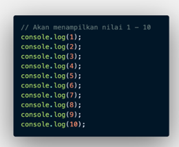

## Switch Case Conditional

Penggunaan switch case jika kondisi dan percabangan terlalu banyak.

## Ternary Operator

Ternary operator merupakan short-syntax dari statement if … else.

# JAVASCRIPT - LOOPING

**Looping** adalah statement yang mengulang sebuah instruksi hingga kondisi terpenuhi atau jika kondisi stop/berhenti tercapai.

## A. Manual Looping


## B. For Loop

**FOR LOOP** merupakan instruksi pengulangan yang dapat kita berikan pada program yang kita kembangkan.

**FOR LOOP** di gunakan jika kita tahu seberapa banyak nilai pasti untuk pengulangannya

**FOR LOOP Parameter**

- Inisialisasi: Sebagai inisialisasi awal dari mana mulainya sebuah pengulangan. Kita memberikan nilai awal/default pada parameter ini
- Condition: For loop akan terus berjalan selama kondisi ini terpenuhi. Selama kondisi bernilai TRUE.
- Post-expression (Increment/Decrement): Iterasi statement yang digunakan untuk mengupdate variabel yang menjadi kontrol pada pengulangan


## C. While Loop

**WHILE LOOP** akan menjalankan instruksi pengulangan kondisi bernilai TRUE.

**WHILE LOOP** jika kita tidak mengetahui jumlah pasti pengulangan.

## D. Do While

Terkadang kita ingin setidaknya menjalankan pengulangan 1 kali sebelum dilakukan pengecekan kondisi


## E. Nested Loop

Jika kita membuat looping didalam looping. Maka ini dinamakan Nested Loop.

Looping pertama dianalogikan sebagai baris.

Looping kedua dianalogikan sebagai kolom


```python

```


```python

```
